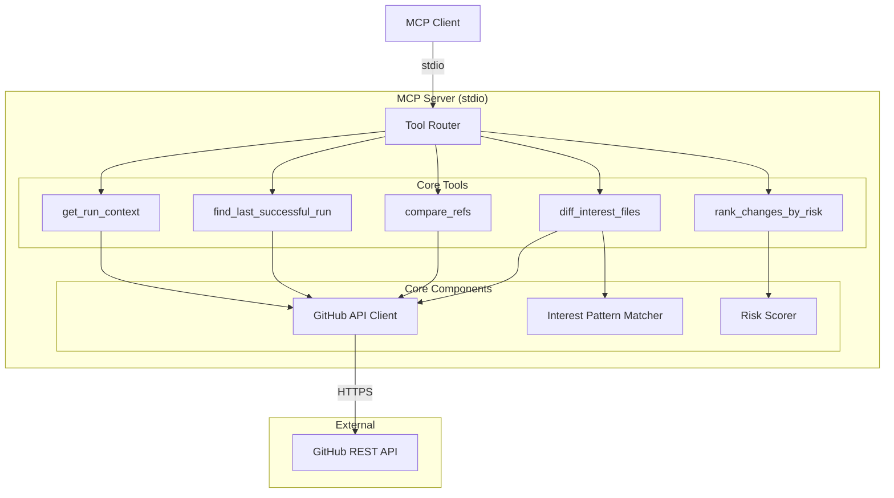

# Design Document

## Overview

whatchanged-mcp is a Python MCP (Model Context Protocol) server that provides read-only GitHub Actions CI failure analysis. The server exposes five core tools via stdio transport that enable an LLM to systematically investigate CI failures by comparing a failed run against its last successful baseline.

The design follows a "diff-first, narrative-last" principle: the server provides factual, evidence-backed data about what changed, and the LLM synthesizes the narrative. All outputs include evidence links to GitHub resources.

### Key Design Decisions

1. **MCP stdio transport**: Chosen for simplicity and compatibility with MCP clients. No HTTP server complexity.
2. **Deterministic risk scoring**: Heuristic-based scoring with fixed weights ensures reproducible, explainable rankings.
3. **Read-only by design**: Only GitHub API endpoints requiring read permissions are used. No write operations.
4. **Evidence-first outputs**: Every suspect must have at least one evidence link. No "AI guessed this" explanations.
5. **Repo allowlist**: Optional safety mechanism to restrict analysis to approved repositories.

## Architecture



### Component Responsibilities

| Component | Responsibility |
|-----------|----------------|
| Tool Router | Dispatches MCP tool calls to appropriate handlers |
| GitHub API Client | Authenticated read-only communication with GitHub REST API |
| Risk Scorer | Applies deterministic heuristics to rank changes |
| Interest Pattern Matcher | Filters files against glob patterns for high-signal extraction |

## Components and Interfaces

### MCP Server Entry Point

```python
# src/whatchanged_mcp/server.py

from mcp.server import Server
from mcp.server.stdio import stdio_server

async def main() -> None:
    """Initialize and run the MCP server on stdio transport."""
    
async def create_server(config: ServerConfig) -> Server:
    """Create configured MCP server with all tools registered."""
```

### Configuration

```python
# src/whatchanged_mcp/config.py

from dataclasses import dataclass

@dataclass
class ServerConfig:
    github_token: str
    repo_allowlist: list[str] | None = None  # e.g., ["owner/repo", "org/*"]
    max_retries: int = 3
    max_bytes_per_file: int = 50_000
    log_level: str = "INFO"

def load_config() -> ServerConfig:
    """Load configuration from environment variables."""
```

### GitHub API Client

```python
# src/whatchanged_mcp/github_client.py

from dataclasses import dataclass
import requests

@dataclass
class RunContext:
    workflow_id: int
    workflow_name: str
    branch: str
    head_sha: str
    conclusion: str
    run_url: str
    created_at: str

@dataclass
class BaselineRun:
    last_successful_run_id: int
    base_sha: str
    timestamp: str
    run_url: str

@dataclass
class Commit:
    sha: str
    message: str
    url: str

@dataclass
class ChangedFile:
    filename: str
    status: str  # added, modified, removed, renamed

@dataclass
class CompareResult:
    commits: list[Commit]
    files: list[ChangedFile]
    compare_url: str

@dataclass
class FileDiff:
    filename: str
    change_summary: str
    evidence_url: str
    truncated: bool = False

class GitHubClient:
    def __init__(self, token: str, max_retries: int = 3):
        """Initialize client with PAT and retry configuration."""
    
    def get_run(self, owner: str, repo: str, run_id: int) -> RunContext:
        """Fetch workflow run metadata."""
    
    def find_last_successful_run(
        self, owner: str, repo: str, workflow: str | int, branch: str
    ) -> BaselineRun | None:
        """Find most recent successful run for workflow/branch."""
    
    def compare_refs(
        self, owner: str, repo: str, base: str, head: str
    ) -> CompareResult:
        """Compare two refs and return commits and changed files."""
    
    def get_file_diff(
        self, owner: str, repo: str, base: str, head: str, filename: str, max_bytes: int
    ) -> FileDiff:
        """Fetch diff content for a specific file."""
    
    def _request_with_retry(
        self, method: str, url: str, **kwargs
    ) -> requests.Response:
        """Execute request with exponential backoff on rate limits."""
```

### Interest Pattern Matcher

```python
# src/whatchanged_mcp/patterns.py

DEFAULT_INTEREST_PATTERNS: list[str] = [
    ".github/workflows/**",
    "**/package-lock.json",
    "**/yarn.lock",
    "**/pnpm-lock.yaml",
    "**/poetry.lock",
    "**/requirements*.txt",
    "**/go.sum",
    "**/Cargo.lock",
    "**/pom.xml",
    "**/build.gradle*",
    "**/Dockerfile*",
    "**/Makefile",
    "**/.tool-versions",
    "**/.nvmrc",
    "**/.python-version",
    "**/.ruby-version",
    "**/terraform.lock.hcl",
    "**/Pulumi.yaml",
    "**/cdk.json",
    "**/.spacelift/**",
]

def matches_interest_pattern(filename: str, patterns: list[str] | None = None) -> bool:
    """Check if filename matches any interest pattern."""

def filter_interest_files(files: list[str], patterns: list[str] | None = None) -> list[str]:
    """Filter file list to only those matching interest patterns."""
```

### Risk Scorer

```python
# src/whatchanged_mcp/risk_scorer.py

from dataclasses import dataclass
from enum import Enum

class RiskCategory(Enum):
    WORKFLOW_YAML = "workflow_yaml"
    LOCKFILE = "lockfile"
    TOOLCHAIN = "toolchain"
    BUILD_SCRIPT = "build_script"
    DOCKERFILE = "dockerfile"
    CACHE_CONFIG = "cache_config"
    PERMISSIONS = "permissions"
    TESTS_ONLY = "tests_only"
    OTHER = "other"

# Baseline weights per requirement 6.2
RISK_WEIGHTS: dict[RiskCategory, int] = {
    RiskCategory.WORKFLOW_YAML: 6,
    RiskCategory.LOCKFILE: 5,
    RiskCategory.TOOLCHAIN: 5,
    RiskCategory.BUILD_SCRIPT: 4,
    RiskCategory.DOCKERFILE: 3,
    RiskCategory.CACHE_CONFIG: 3,
    RiskCategory.PERMISSIONS: 2,
    RiskCategory.TESTS_ONLY: 1,
    RiskCategory.OTHER: 0,
}

@dataclass
class Suspect:
    category: RiskCategory
    score: int
    rationale: str
    evidence_urls: list[str]

def categorize_file(filename: str, diff_content: str | None = None) -> RiskCategory:
    """Determine risk category for a changed file."""

def score_changes(
    files: list[ChangedFile],
    diffs: dict[str, FileDiff],
) -> list[Suspect]:
    """Score and rank changes by risk, returning top suspects."""

def has_sufficient_evidence(suspects: list[Suspect]) -> bool:
    """Check if any suspect has score > 2 (sufficient evidence threshold)."""
```

### MCP Tool Handlers

```python
# src/whatchanged_mcp/tools.py

from mcp.types import Tool, TextContent

# Tool definitions
GET_RUN_CONTEXT_TOOL = Tool(
    name="get_run_context",
    description="Get context about a GitHub Actions workflow run",
    inputSchema={
        "type": "object",
        "properties": {
            "owner": {"type": "string", "description": "Repository owner"},
            "repo": {"type": "string", "description": "Repository name"},
            "run_id": {"type": "integer", "description": "Workflow run ID"},
        },
        "required": ["owner", "repo", "run_id"],
    },
)

FIND_LAST_SUCCESSFUL_RUN_TOOL = Tool(
    name="find_last_successful_run",
    description="Find the most recent successful run for a workflow and branch",
    inputSchema={
        "type": "object",
        "properties": {
            "owner": {"type": "string"},
            "repo": {"type": "string"},
            "workflow": {"type": "string", "description": "Workflow ID or filename"},
            "branch": {"type": "string"},
        },
        "required": ["owner", "repo", "workflow", "branch"],
    },
)

COMPARE_REFS_TOOL = Tool(
    name="compare_refs",
    description="Compare two git refs and return commits and changed files",
    inputSchema={
        "type": "object",
        "properties": {
            "owner": {"type": "string"},
            "repo": {"type": "string"},
            "base_sha": {"type": "string"},
            "head_sha": {"type": "string"},
        },
        "required": ["owner", "repo", "base_sha", "head_sha"],
    },
)

DIFF_INTEREST_FILES_TOOL = Tool(
    name="diff_interest_files",
    description="Get detailed diffs for high-signal files (workflows, lockfiles, etc.)",
    inputSchema={
        "type": "object",
        "properties": {
            "owner": {"type": "string"},
            "repo": {"type": "string"},
            "base_sha": {"type": "string"},
            "head_sha": {"type": "string"},
            "files": {"type": "array", "items": {"type": "string"}},
            "patterns": {"type": "array", "items": {"type": "string"}, "description": "Optional custom patterns"},
        },
        "required": ["owner", "repo", "base_sha", "head_sha", "files"],
    },
)

RANK_CHANGES_BY_RISK_TOOL = Tool(
    name="rank_changes_by_risk",
    description="Rank changes by likelihood of causing CI failure",
    inputSchema={
        "type": "object",
        "properties": {
            "run_context": {"type": "object"},
            "changed_files": {"type": "array", "items": {"type": "object"}},
            "diff_summaries": {"type": "object"},
        },
        "required": ["run_context", "changed_files"],
    },
)

async def handle_get_run_context(
    client: GitHubClient, owner: str, repo: str, run_id: int
) -> list[TextContent]:
    """Handle get_run_context tool call."""

async def handle_find_last_successful_run(
    client: GitHubClient, owner: str, repo: str, workflow: str, branch: str
) -> list[TextContent]:
    """Handle find_last_successful_run tool call."""

async def handle_compare_refs(
    client: GitHubClient, owner: str, repo: str, base_sha: str, head_sha: str
) -> list[TextContent]:
    """Handle compare_refs tool call."""

async def handle_diff_interest_files(
    client: GitHubClient,
    owner: str,
    repo: str,
    base_sha: str,
    head_sha: str,
    files: list[str],
    patterns: list[str] | None = None,
    max_bytes: int = 50_000,
) -> list[TextContent]:
    """Handle diff_interest_files tool call."""

def handle_rank_changes_by_risk(
    run_context: dict,
    changed_files: list[dict],
    diff_summaries: dict | None = None,
) -> list[TextContent]:
    """Handle rank_changes_by_risk tool call."""
```

### Allowlist Validator

```python
# src/whatchanged_mcp/allowlist.py

def is_repo_allowed(owner: str, repo: str, allowlist: list[str] | None) -> bool:
    """Check if owner/repo is in the allowlist.
    
    Allowlist supports:
    - Exact match: "owner/repo"
    - Org wildcard: "org/*"
    - None means all repos allowed
    """

def validate_repo_access(owner: str, repo: str, allowlist: list[str] | None) -> None:
    """Raise AuthorizationError if repo not in allowlist."""
```

### Error Types

```python
# src/whatchanged_mcp/errors.py

class WhatChangedError(Exception):
    """Base error for whatchanged-mcp."""
    
class AuthenticationError(WhatChangedError):
    """PAT missing, invalid, or expired."""

class AuthorizationError(WhatChangedError):
    """Repository not in allowlist."""

class NotFoundError(WhatChangedError):
    """Requested resource not found."""

class RateLimitError(WhatChangedError):
    """Rate limit exceeded after retries."""

class InsufficientPermissionsError(WhatChangedError):
    """PAT lacks required permissions."""

class ValidationError(WhatChangedError):
    """Input validation failed."""
```

## Data Models

### Tool Input/Output Schemas

#### get_run_context

Input:
```json
{
  "owner": "string",
  "repo": "string",
  "run_id": "integer"
}
```

Output:
```json
{
  "workflow_id": "integer",
  "workflow_name": "string",
  "branch": "string",
  "head_sha": "string",
  "conclusion": "string",
  "run_url": "string",
  "created_at": "string (ISO 8601)"
}
```

#### find_last_successful_run

Input:
```json
{
  "owner": "string",
  "repo": "string",
  "workflow": "string (ID or filename)",
  "branch": "string"
}
```

Output:
```json
{
  "last_successful_run_id": "integer",
  "base_sha": "string",
  "timestamp": "string (ISO 8601)",
  "run_url": "string"
}
```

Or if no baseline found:
```json
{
  "found": false,
  "message": "No successful run found for workflow X on branch Y"
}
```

#### compare_refs

Input:
```json
{
  "owner": "string",
  "repo": "string",
  "base_sha": "string",
  "head_sha": "string"
}
```

Output:
```json
{
  "commits": [
    {"sha": "string", "message": "string", "url": "string"}
  ],
  "files": [
    {"filename": "string", "status": "added|modified|removed|renamed"}
  ],
  "compare_url": "string"
}
```

#### diff_interest_files

Input:
```json
{
  "owner": "string",
  "repo": "string",
  "base_sha": "string",
  "head_sha": "string",
  "files": ["string"],
  "patterns": ["string"] // optional
}
```

Output:
```json
{
  "diffs": [
    {
      "filename": "string",
      "change_summary": "string",
      "evidence_url": "string",
      "truncated": "boolean"
    }
  ],
  "matched_count": "integer",
  "total_files": "integer"
}
```

#### rank_changes_by_risk

Input:
```json
{
  "run_context": {"..."},
  "changed_files": [{"filename": "string", "status": "string"}],
  "diff_summaries": {"filename": {"change_summary": "string"}} // optional
}
```

Output:
```json
{
  "suspects": [
    {
      "category": "string",
      "score": "integer",
      "rationale": "string",
      "evidence_urls": ["string"]
    }
  ],
  "sufficient_evidence": "boolean",
  "what_did_not_change": ["string"],
  "unknowns": ["string"]
}
```

### Final Analysis Response Schema

```json
{
  "failed_run_url": "string",
  "last_successful_run_url": "string",
  "base_sha": "string",
  "head_sha": "string",
  "top_suspects": [
    {
      "category": "string",
      "score": "integer",
      "rationale": "string",
      "evidence_urls": ["string"]
    }
  ],
  "what_did_not_change": ["string"],
  "unknowns_or_missing_signals": ["string"]
}
```


## Correctness Properties

*A property is a characteristic or behavior that should hold true across all valid executions of a system—essentially, a formal statement about what the system should do. Properties serve as the bridge between human-readable specifications and machine-verifiable correctness guarantees.*

### Property 1: Allowlist Enforcement

*For any* repository request and configured allowlist, the request SHALL be accepted if and only if the repository matches an entry in the allowlist (exact match "owner/repo" or wildcard "org/*").

**Validates: Requirements 1.3, 1.4**

### Property 2: Run Context Response Completeness

*For any* valid workflow run, the get_run_context response SHALL contain all required fields: workflow_id, workflow_name, branch, head_sha, conclusion, run_url, and created_at.

**Validates: Requirements 2.1, 2.5**

### Property 3: Exponential Backoff Retry

*For any* rate-limited API request, the client SHALL retry with exponentially increasing delays (with jitter) up to 3 attempts before failing.

**Validates: Requirements 2.4, 8.5**

### Property 4: Baseline Run Recency

*For any* workflow and branch with multiple successful runs, find_last_successful_run SHALL return the run with the most recent timestamp.

**Validates: Requirements 3.1**

### Property 5: Baseline Response Completeness

*For any* successful baseline lookup, the response SHALL contain all required fields: last_successful_run_id, base_sha, timestamp, and run_url.

**Validates: Requirements 3.2, 3.4**

### Property 6: Workflow Name Resolution

*For any* workflow parameter provided as a filename (e.g., "ci.yml"), the client SHALL resolve it to the corresponding workflow_id before querying runs.

**Validates: Requirements 3.5**

### Property 7: Compare Response Structure

*For any* valid ref comparison, the response SHALL contain: a list of commits (each with sha, message, url), a list of files (each with filename, status), and a compare_url.

**Validates: Requirements 4.1, 4.2, 4.3, 4.4**

### Property 8: Interest Pattern Filtering

*For any* list of changed files and interest patterns, diff_interest_files SHALL return only files that match at least one pattern.

**Validates: Requirements 5.1**

### Property 9: Interest File Diff Retrieval

*For any* file matching an interest pattern, the diff response SHALL include filename, change_summary, and evidence_url.

**Validates: Requirements 5.3, 5.4**

### Property 10: Diff Truncation Indication

*For any* file diff exceeding max_bytes_per_file, the response SHALL set truncated=true and indicate truncation in the change_summary.

**Validates: Requirements 5.5**

### Property 11: Risk Scoring Weight Application

*For any* changed file, the Risk_Scorer SHALL assign the correct baseline weight based on category: workflow YAML (+6), lockfile (+5), toolchain (+5), build scripts (+4), Dockerfile (+3), cache config (+3), permissions (+2), tests-only (+1).

**Validates: Requirements 6.2**

### Property 12: Evidence Requirement Invariant

*For any* Suspect in the ranked output, the evidence_urls array SHALL be non-empty (at least one evidence link).

**Validates: Requirements 6.3, 7.4**

### Property 13: Insufficient Evidence Indication

*For any* set of changes where all suspect scores are ≤ 2, the response SHALL indicate "insufficient evidence to identify likely culprits".

**Validates: Requirements 6.4**

### Property 14: Suspect Structure Completeness

*For any* Suspect in the output, it SHALL contain: category, score, rationale, and evidence_urls array.

**Validates: Requirements 6.6**

### Property 15: Final Response Structure

*For any* complete analysis, the response SHALL contain: failed_run_url, last_successful_run_url, base_sha, head_sha, top_suspects, what_did_not_change, and unknowns_or_missing_signals.

**Validates: Requirements 7.1, 7.2, 7.3**

### Property 16: Log Secret Redaction

*For any* log message containing patterns matching secrets or tokens (PAT, API keys), the sensitive content SHALL be redacted before output.

**Validates: Requirements 8.3**

### Property 17: Input Injection Validation

*For any* input parameter containing potential injection patterns (path traversal, shell metacharacters), the server SHALL reject or sanitize the input before constructing API requests.

**Validates: Requirements 8.4**

### Property 18: API Error Response Structure

*For any* failed GitHub API request, the error response SHALL include the HTTP status code and error message.

**Validates: Requirements 9.1**

### Property 19: Validation Error Listing

*For any* request with missing required parameters, the error response SHALL list all missing parameter names.

**Validates: Requirements 9.3**

### Property 20: Error Evidence Inclusion

*For any* error response where evidence links are available (e.g., partial data retrieved), the error SHALL include those evidence links.

**Validates: Requirements 9.5**

## Error Handling

### Error Categories

| Error Type | HTTP Status | User Message | Recovery |
|------------|-------------|--------------|----------|
| AuthenticationError | 401 | "Invalid or missing GitHub PAT" | Check GITHUB_TOKEN env var |
| AuthorizationError | 403 | "Repository not in allowlist" | Add repo to allowlist |
| NotFoundError | 404 | "Run/workflow/repo not found" | Verify IDs exist |
| RateLimitError | 429 | "Rate limit exceeded after retries" | Wait and retry |
| InsufficientPermissionsError | 403 | "PAT lacks required permissions" | Update PAT scopes |
| ValidationError | 400 | "Invalid input: {details}" | Fix input parameters |

### Retry Strategy

```python
def _request_with_retry(self, method: str, url: str, **kwargs) -> requests.Response:
    """
    Retry strategy for rate limits:
    - Initial delay: 1 second
    - Backoff multiplier: 2x
    - Jitter: ±0.5 seconds
    - Max retries: 3
    - Max delay: 30 seconds
    """
    base_delay = 1.0
    max_delay = 30.0
    
    for attempt in range(self.max_retries + 1):
        response = self._session.request(method, url, **kwargs)
        
        if response.status_code != 429:
            return response
            
        if attempt == self.max_retries:
            raise RateLimitError("Rate limit exceeded after max retries")
        
        # Calculate delay with exponential backoff and jitter
        delay = min(base_delay * (2 ** attempt), max_delay)
        jitter = random.uniform(-0.5, 0.5)
        time.sleep(delay + jitter)
    
    return response  # unreachable
```

### Error Response Format

All errors return structured JSON:

```json
{
  "error": {
    "type": "AuthenticationError",
    "message": "Invalid or missing GitHub PAT",
    "details": "GITHUB_TOKEN environment variable not set",
    "evidence_urls": []
  }
}
```

### Partial Failure Handling

When compare_refs or diff_interest_files partially succeeds:

```json
{
  "error": {
    "type": "PartialFailure",
    "message": "Some diffs could not be retrieved",
    "details": "2 of 5 files failed to fetch",
    "partial_data": {
      "successful_diffs": [...],
      "failed_files": ["path/to/file1.yml", "path/to/file2.lock"]
    },
    "evidence_urls": ["https://github.com/owner/repo/compare/base...head"]
  }
}
```

## Testing Strategy

### Dual Testing Approach

This project uses both unit tests and property-based tests for comprehensive coverage:

- **Unit tests**: Verify specific examples, edge cases, integration points, and error conditions
- **Property tests**: Verify universal properties across randomized inputs

### Property-Based Testing Configuration

- **Library**: [hypothesis](https://hypothesis.readthedocs.io/) for Python
- **Minimum iterations**: 100 per property test
- **Tag format**: `# Feature: whatchanged-mcp, Property {N}: {property_text}`

### Test Structure

```
tests/
├── unit/
│   ├── test_config.py           # Configuration loading
│   ├── test_allowlist.py        # Allowlist validation
│   ├── test_patterns.py         # Interest pattern matching
│   ├── test_risk_scorer.py      # Risk scoring logic
│   ├── test_github_client.py    # API client (mocked)
│   └── test_tools.py            # Tool handlers
├── property/
│   ├── test_allowlist_props.py  # Property 1
│   ├── test_response_props.py   # Properties 2, 5, 7, 9, 14, 15
│   ├── test_retry_props.py      # Property 3
│   ├── test_baseline_props.py   # Properties 4, 6
│   ├── test_filter_props.py     # Properties 8, 10
│   ├── test_scoring_props.py    # Properties 11, 12, 13
│   ├── test_security_props.py   # Properties 16, 17
│   └── test_error_props.py      # Properties 18, 19, 20
└── integration/
    └── test_mcp_server.py       # End-to-end MCP protocol tests
```

### Property Test Examples

```python
# tests/property/test_allowlist_props.py
from hypothesis import given, strategies as st, settings

# Feature: whatchanged-mcp, Property 1: Allowlist Enforcement
@given(
    owner=st.text(min_size=1, alphabet=st.characters(whitelist_categories=('L', 'N'))),
    repo=st.text(min_size=1, alphabet=st.characters(whitelist_categories=('L', 'N'))),
    allowlist=st.lists(st.text(min_size=1)),
)
@settings(max_examples=100)
def test_allowlist_enforcement(owner: str, repo: str, allowlist: list[str]):
    """For any repo and allowlist, acceptance matches allowlist membership."""
    full_name = f"{owner}/{repo}"
    is_allowed = is_repo_allowed(owner, repo, allowlist)
    
    # Should be allowed iff matches exact or wildcard
    expected = (
        full_name in allowlist or
        f"{owner}/*" in allowlist or
        allowlist is None
    )
    assert is_allowed == expected
```

```python
# tests/property/test_scoring_props.py
from hypothesis import given, strategies as st, settings

# Feature: whatchanged-mcp, Property 12: Evidence Requirement Invariant
@given(
    files=st.lists(
        st.fixed_dictionaries({
            "filename": st.text(min_size=1),
            "status": st.sampled_from(["added", "modified", "removed", "renamed"]),
        }),
        min_size=1,
    ),
)
@settings(max_examples=100)
def test_evidence_requirement_invariant(files: list[dict]):
    """For any suspect in output, evidence_urls must be non-empty."""
    suspects = score_changes(files, {})
    
    for suspect in suspects:
        assert len(suspect.evidence_urls) > 0, f"Suspect {suspect.category} has no evidence"
```

### Unit Test Coverage

| Component | Key Test Cases |
|-----------|----------------|
| Config | Valid PAT loading, missing PAT error, allowlist parsing |
| Allowlist | Exact match, wildcard match, no match, empty allowlist |
| Patterns | Glob matching, default patterns, custom patterns |
| Risk Scorer | Category detection, weight application, ranking order |
| GitHub Client | Success responses, 404 handling, rate limit retry |
| Tools | Valid inputs, missing params, error propagation |

### Integration Tests

Integration tests verify the complete MCP protocol flow:

1. Server initialization with valid config
2. Tool registration and discovery
3. Tool invocation with valid parameters
4. Error responses for invalid inputs
5. Stdio transport communication

### Mocking Strategy

- **GitHub API**: Use `responses` or `requests-mock` to mock HTTP responses
- **Rate limits**: Simulate 429 responses to test retry logic
- **Partial failures**: Mock mixed success/failure responses

